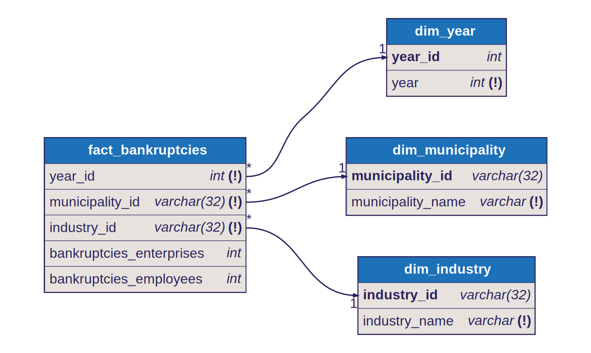

# Star Schema: Bankruptcies

## Fact Table

- `fact_bankruptcies`
- Grain: one row per `year x municipality x industry`

## Dimensions

- `dim_year`
  - joined by `year_id`
- `dim_municipality`
  - joined by `municipality_id`
- `dim_industry`
  - joined by `industry_id`

## Model Shape

This is the base bankruptcy fact for the warehouse.

Dimension keys in the fact:

- `year_id`
- `municipality_id`
- `industry_id`

Measures in the fact include:

- bankruptcies enterprise count
- bankruptcies employee count

## Modeling Note

This is the base bankruptcy detail fact for the warehouse. It includes only classified industry rows — `Total` and `Industry unknown` are excluded to prevent double-counting. Models that need municipality-level totals source the pre-aggregated `Total` row directly from silver.

## Diagram

Source: [`docs/diagrams/bankruptcies.dbml`](../diagrams/bankruptcies.dbml) — SVGs are auto-generated by CI on every DBML change.

## Notes

- `Total` and `Industry unknown` rows are excluded to prevent double-counting
- this is the reusable detailed bankruptcy fact that several derived facts build on