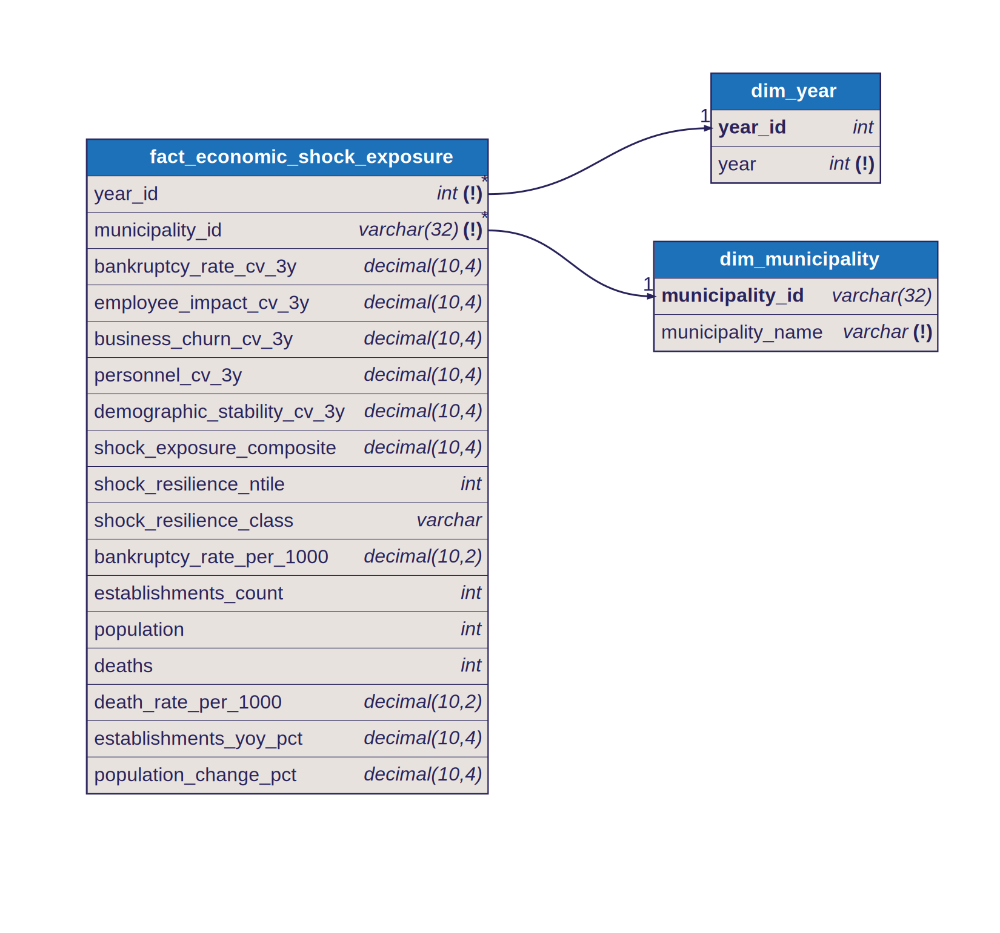

# Star Schema: Economic Shock Exposure

## Fact Table

- `fact_economic_shock_exposure`
- Grain: one row per `year x municipality`

## Dimensions

- `dim_year`
  - joined by `year_id`
- `dim_municipality`
  - joined by `municipality_id`

## Model Shape

This fact measures municipality vulnerability to sudden economic disruptions using rolling 3-year coefficients of variation (CV) across five volatility dimensions: bankruptcy rate, employee impact, business churn, personnel, and demographics.

Dimension keys in the fact:

- `year_id`
- `municipality_id`

Measures in the fact include:

- five rolling 3-year CV measures (bankruptcy rate, employee impact, business churn, personnel, demographic stability)
- weighted shock exposure composite index
- shock resilience ntile and class
- current-year snapshot measures (bankruptcy rate, establishments, population, deaths, death rate)
- year-over-year component measures (establishments YoY %, population change %)

## Modeling Note

The five CV measures capture different dimensions of economic volatility. Each CV is the standard deviation divided by the mean over a rolling 3-year window — isolating how erratic a signal is, not its level.

The `shock_exposure_composite` applies fixed domain-driven weights (bankruptcy 35%, employee impact 25%, business churn 20%, personnel 10%, demographic 10%) to produce a single volatility score. `shock_resilience_ntile` then partitions municipalities into quartiles within each year, mapped to human-readable labels in `shock_resilience_class`.

CV measures are NULL when fewer than 3 calendar years of data exist. Business churn and demographic CVs additionally require 2+ non-null YoY inputs within the window.

## Diagram

Source: [`docs/diagrams/economic_shock_exposure.dbml`](../diagrams/economic_shock_exposure.dbml) — SVGs are auto-generated by CI on every DBML change.

## Notes

- All CV measures and `shock_exposure_composite` are NULL for the first two municipality-years (rolling window requires 3 consecutive years)
- `shock_resilience_ntile` uses `ntile(4)` partitioned by year on `shock_exposure_composite` ASC, so the same composite value may map to different quartiles across years
- The rolling window assumes consecutive annual data; CVs may span non-adjacent years if the source contains year gaps
