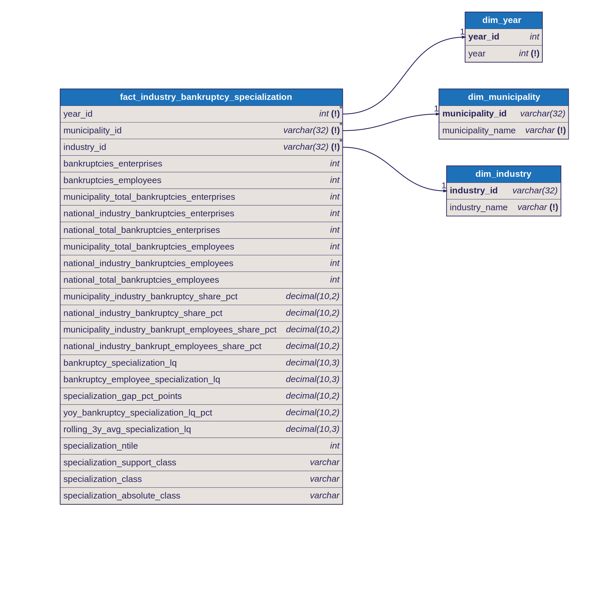

# Star Schema: Industry Bankruptcy Specialization

## Fact Table

- `fact_industry_bankruptcy_specialization`
- Grain: one row per `year x municipality x industry`

## Dimensions

- `dim_year`
  - joined by `year_id`
- `dim_municipality`
  - joined by `municipality_id`
- `dim_industry`
  - joined by `industry_id`

## Why This Is A Star Schema

The model is intentionally organized so that descriptive context sits in dimensions and analytical measures sit in the fact.

Dimension keys in the fact:

- `year_id`
- `municipality_id`
- `industry_id`

Measures in the fact include:

- bankruptcies enterprise count
- bankruptcies employee count
- municipality totals and national totals
- bankruptcy share metrics
- enterprise-based and employee-based specialization LQs
- year-over-year change and rolling average metrics
- specialization support and trend-safe classification fields

## Classification Design

The fact exposes two different classification concepts for different analytical tasks.

### Support quality classification

- `specialization_support_class`
- separates `No bankruptcies`, `Single bankruptcy signal`, `Thin municipality bankruptcy base`, and `Supported signal`

Use this for:

- filtering dashboards to statistically stronger signals
- separating high-LQ but low-volume rows from reliable cases

### Trend-safe severity classification

- `specialization_absolute_class`
- `No bankruptcies` when `bankruptcies_enterprises = 0`
- positive rows are assigned to fixed dataset-wide global quartile bands across all years combined

Use this for:

- cross-year distribution charts
- trend interpretation of specialization severity

Do not use this for:

- support-quality filtering

## Textbook Star Schema Note

This model is intentionally documented as a stricter star schema:

- the fact table exposes foreign keys and measures only
- descriptive names are retrieved from the dimension tables

This is slightly less convenient for direct BI exploration, but more aligned with textbook dimensional modeling practice.

## Diagram

Source: [`docs/diagrams/industry_bankruptcy_specialization.dbml`](../diagrams/industry_bankruptcy_specialization.dbml) — SVGs are auto-generated by CI on every DBML change.

## Notes

- the implemented grain is `year x municipality x industry`
- the uniqueness rule is the composite grain `(year_id, municipality_id, industry_id)`
- dashboard filters should distinguish between supported-only analysis and explicit all-support-class exceptions