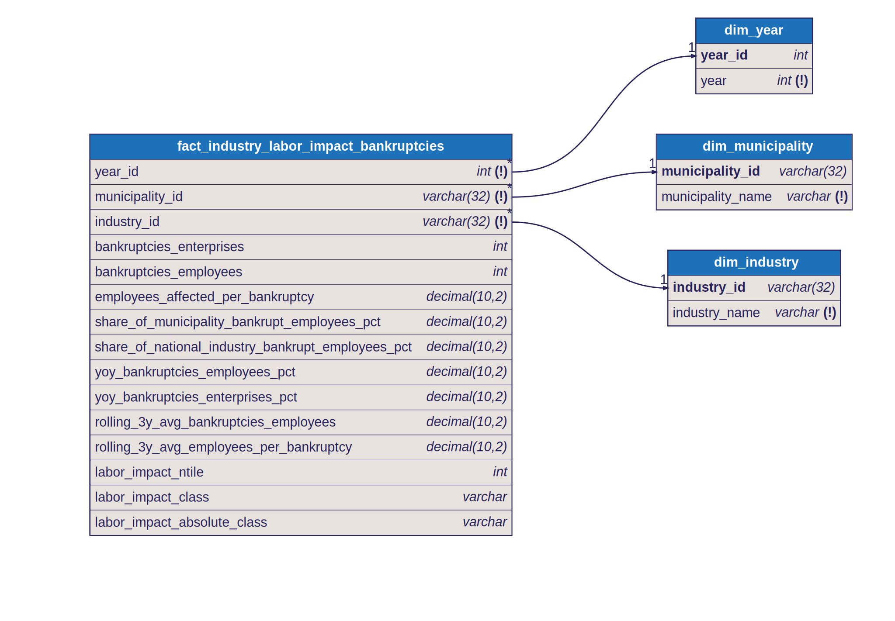

# Star Schema: Industry Labor Impact Bankruptcies

## Fact Table

- `fact_industry_labor_impact_bankruptcies`
- Grain: one row per `year x municipality x industry`

## Dimensions

- `dim_year`
  - joined by `year_id`
- `dim_municipality`
  - joined by `municipality_id`
- `dim_industry`
  - joined by `industry_id`

## Why This Is A Star Schema

The model is intentionally organized so that descriptive context sits in dimensions and analytical measures sit in the fact.

Dimension keys in the fact:

- `year_id`
- `municipality_id`
- `industry_id`

Measures in the fact include:

- bankruptcies enterprise count
- bankruptcies employee count
- employees affected per bankruptcy
- municipality share and national industry share metrics
- year-over-year change metrics
- rolling averages
- relative and trend-safe labor impact classifications

## Classification Design

The fact exposes two labor impact classifications for different analytical tasks.

### Relative classification

- `labor_impact_class`
- built from `labor_impact_ntile`
- uses `ntile(4)` partitioned by year

Use this for:

- ranking the most severe municipality-industry combinations within a given year

Do not use this for:

- cross-year trend interpretation of class distribution

### Trend-safe classification

- `labor_impact_absolute_class`
- `No labor impact` when `bankruptcies_employees = 0`
- positive rows are assigned to fixed dataset-wide global quartile bands across all years combined

Use this for:

- distribution-over-time charts
- trend interpretation of labor impact severity

## Metric Notes

- `yoy_bankruptcies_employees_pct` and `yoy_bankruptcies_enterprises_pct` are only populated when the prior row is exactly `year - 1`
- `rolling_3y_avg_employees_per_bankruptcy` is calculated as a 3-year ratio-of-sums, not an average of yearly ratios

## Textbook Star Schema Note

This model is intentionally documented as a stricter star schema:

- the fact table exposes foreign keys and measures only
- descriptive names are retrieved from the dimension tables

This is slightly less convenient for direct BI exploration, but more aligned with textbook dimensional modeling practice.

## Diagram

Source: [`docs/diagrams/industry_labor_impact_bankruptcies.dbml`](../diagrams/industry_labor_impact_bankruptcies.dbml) — SVGs are auto-generated by CI on every DBML change.

## Notes

- this is the most detailed gold fact in the project
- it should be aggregated before combining with municipality-level facts in dashboards or ad hoc reporting