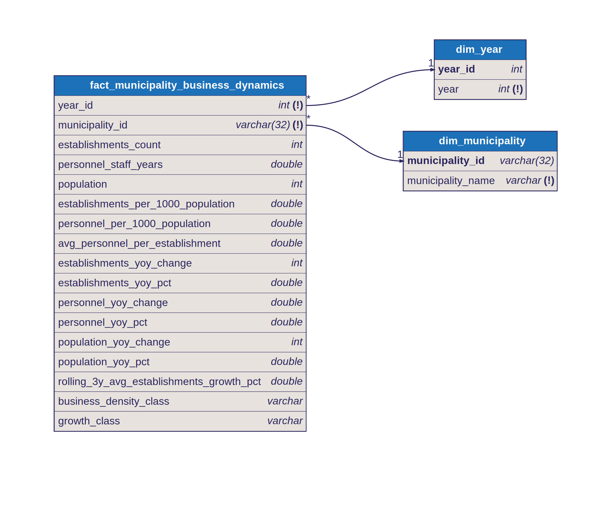

# Star Schema: Municipality Business Dynamics

## Fact Table

- `fact_municipality_business_dynamics`
- Grain: one row per `year × municipality`

## Dimensions

- `dim_year` → `year_id`
  Provides the calendar year for each observation.

- `dim_municipality` → `municipality_id`
  Provides the municipality name. Key is `md5(municipality_name)`.

## Why This Is A Star Schema

The fact table holds only foreign keys (`year_id`, `municipality_id`) and 15 numeric/categorical measures — establishment counts, personnel volumes, population, per-capita ratios, year-over-year changes, a rolling growth average, and quartile classifications. All descriptive context (year labels, municipality names) lives in the dimension tables. Dashboards join the compact fact rows to dimensions at query time, keeping scans fast and filters efficient.

## Diagram

Source: [`docs/diagrams/municipality_business_dynamics.dbml`](../diagrams/municipality_business_dynamics.dbml) — SVGs are auto-generated by CI on every DBML change.
