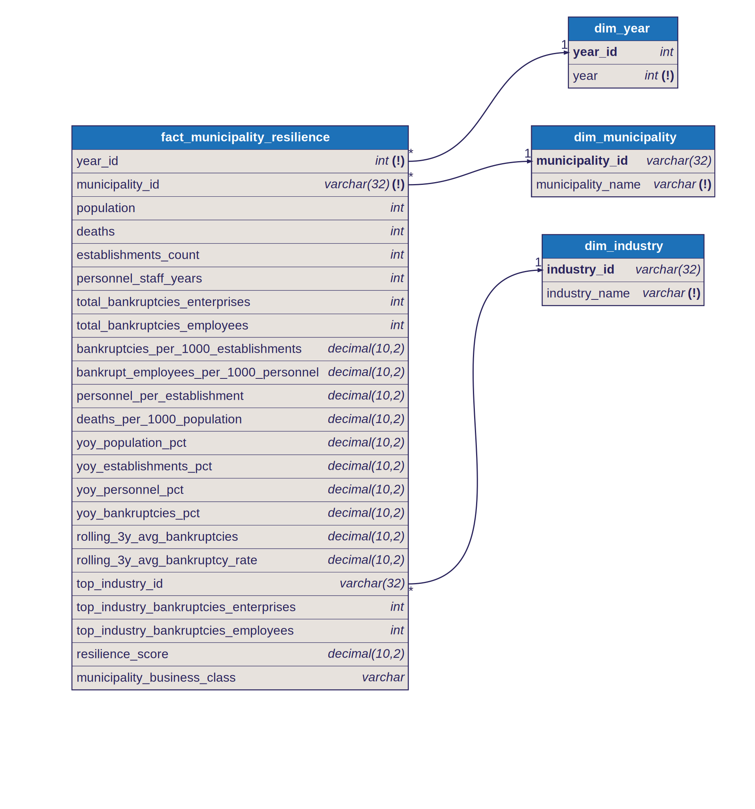

# Star Schema: Municipality Resilience

## Fact Table

- `fact_municipality_resilience`
- Grain: one row per `year x municipality`

## Dimensions

- `dim_year`
  - joined by `year_id`
- `dim_municipality`
  - joined by `municipality_id`
- `dim_industry`
  - joined by `top_industry_id`

## Model Shape

This fact combines municipality demographics, business base, bankruptcy stress, growth trends, and a weighted resilience score.

Dimension keys in the fact:

- `year_id`
- `municipality_id`

Measures in the fact include:

- population, deaths, establishments, and personnel
- bankruptcy totals and derived rates
- year-over-year change metrics
- rolling averages
- resilience score and business class

## Modeling Note

This is a hybrid star that combines municipality demographics, business base, bankruptcy stress, growth trends, and a weighted resilience score.

The top bankruptcy industry is resolved to `top_industry_id`, a foreign key to `dim_industry`, so Genie can join to industry names without embedding labels in the fact.

## Diagram

Source: [`docs/diagrams/municipality_resilience.dbml`](../diagrams/municipality_resilience.dbml) — SVGs are auto-generated by CI on every DBML change.

## Notes

- `resilience_score` is a heuristic weighted composite, not a statistically validated index
- `resilience_score` and `municipality_business_class` are `NULL` for the first year because the score depends partly on year-over-year inputs
- the model uses gap-aware YoY logic so non-consecutive municipality years do not produce misleading year-over-year values