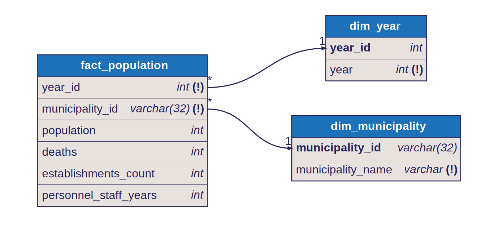

# Star Schema: Population

## Fact Table

- `fact_population`
- Grain: one row per `year x municipality`

## Dimensions

- `dim_year`
  - joined by `year_id`
- `dim_municipality`
  - joined by `municipality_id`

## Model Shape

This fact provides the reusable municipality denominator layer for population, establishments, and personnel.

Dimension keys in the fact:

- `year_id`
- `municipality_id`

Measures in the fact include:

- population
- deaths
- establishments count
- personnel staff years

## Modeling Note

This fact is primarily a reusable supporting fact for downstream models rather than a standalone dashboard model.

## Diagram

Source: [`docs/diagrams/population.dbml`](../diagrams/population.dbml) — SVGs are auto-generated by CI on every DBML change.

## Notes

- deaths are included alongside population and business-base metrics
- it is primarily a reusable supporting fact rather than a standalone dashboard model