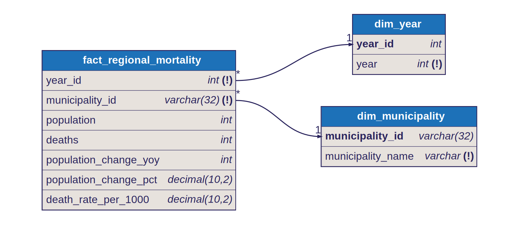

# Star Schema: Regional Mortality

## Fact Table

- `fact_regional_mortality`
- Grain: one row per `year x municipality`

## Dimensions

- `dim_year`
  - joined by `year_id`
- `dim_municipality`
  - joined by `municipality_id`

## Model Shape

This fact tracks municipality mortality and population change over time.

Dimension keys in the fact:

- `year_id`
- `municipality_id`

Measures in the fact include:

- population
- deaths
- year-over-year population change
- year-over-year population change percent
- death rate per 1000

## Modeling Note

Year-over-year population change fields are only populated when the municipality has a row in the immediately prior calendar year.

## Diagram

Source: [`docs/diagrams/regional_mortality.dbml`](../diagrams/regional_mortality.dbml) — SVGs are auto-generated by CI on every DBML change.

## Notes

- `population_change_*` fields are only populated when the municipality has a row in the immediately prior calendar year
- this fact is intended for time-series regional demographic monitoring